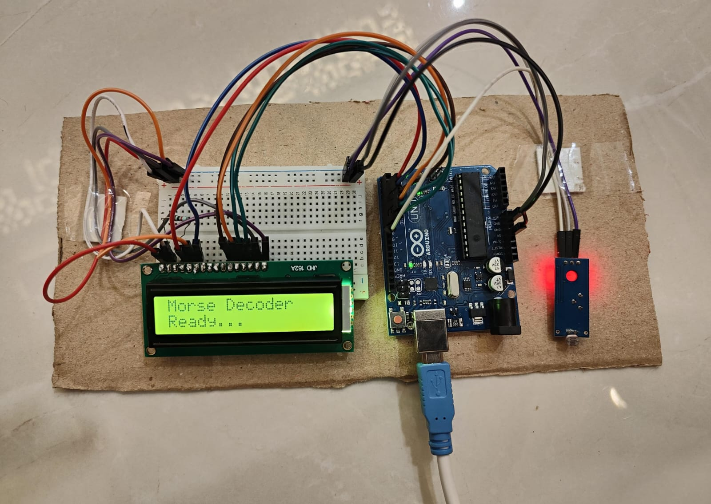

# LiFi Communication System

## Project Description

This project demonstrates a basic LiFi (Light Fidelity) communication system using visible light to transmit information.

## Components Used

- Arduino UNO
- LDR (Light Dependent Resistor)
- LED / Mobile flashlight as transmitter
- 16×2 LCD display
- Jumper wires
- Breadboard

## Working

The transmitter sends information using rapid changes in light intensity. The LDR detects these light changes and sends the signal to the Arduino UNO. The Arduino processes the received signal and displays the decoded information on the LCD.

## Applications

- Wireless communication
- Indoor communication
- Smart lighting systems
- Short-range data transmission
- ## Project Prototype

